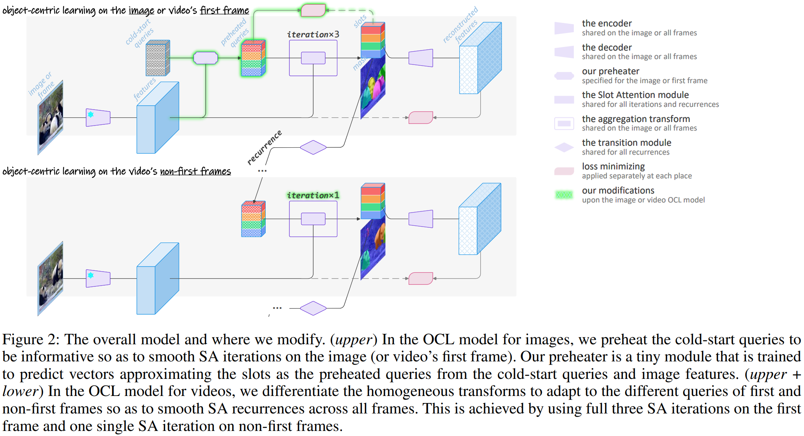
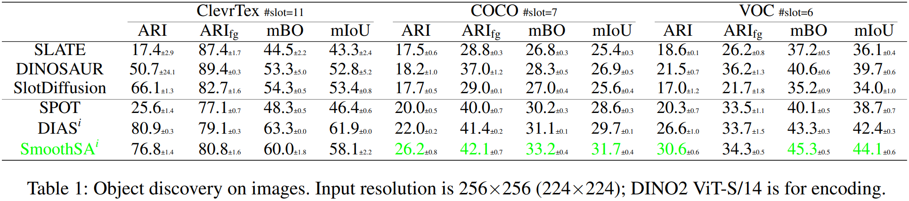
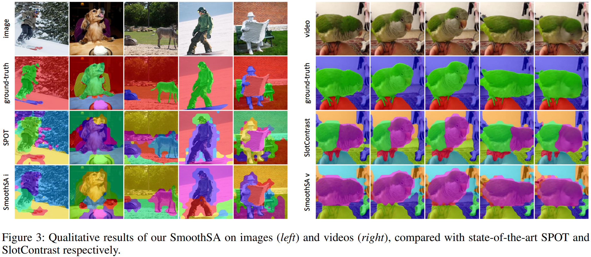

# SmoothSA : Smoothing Slot Attention Iterations and Recurrences


[](https://arxiv.org/abs/2508.05417)
[](LICENSE)
[](https://www.python.org)
[](https://pytorch.org)
[](https://github.com/Genera1Z/SmoothSA?tab=readme-ov-file#-model-checkpoints--training-logs)
[](https://github.com/Genera1Z/SmoothSA?tab=readme-ov-file#-model-checkpoints--training-logs)


Slot Attention (SA) and its variants lie at the heart of mainstream Object-Centric Learning (OCL). Objects in an image can be aggregated into respective slot vectors, by \textit{iteratively} refining cold-start query vectors, typically three times, via SA on image features. For video, such aggregation is \textit{recurrently} shared across frames, with queries cold-started on the first frame while transitioned from the previous frame's slots on non-first frames. However, the cold-start queries lack sample-specific cues thus hinder precise aggregation on the image or video's first frame; Also, non-first frames' queries are already sample-specific thus require transforms different from the first frame's aggregation. We address these issues for the first time with our \textit{SmoothSA}: (1) To smooth SA iterations on the image or video's first frame, we \textit{preheat} the cold-start queries with rich information of input features, via a tiny module self-distilled inside OCL; (2) To smooth SA recurrences across all video frames, we \textit{differentiate} the homogeneous transforms on the first and non-first frames, by using full and single iterations respectively. Comprehensive experiments on object discovery, recognition and downstream benchmarks validate our method's effectiveness. Further analyses intuitively illuminate how our method smooths SA iterations and recurrences.


<!-- ## 🎉 Accepted to ACM MM 2025 as a Poster -->

Official source code, model checkpoints and training logs for paper "**Smoothing Slot Attention Iterations and Recurrences**".

**Our model achitecture**:



## 🏆 Performance

### (1) ⭐⭐⭐ Re-evaluated Performance Values @ Version 3 ⭐⭐⭐

**Object discovery**:

|                     | ari      | arifg    | mbo      | miou     |
|---------------------|----------|----------|----------|----------|
| smoothsa_r-clevrtex | 76.9±1.4 | 80.7±1.7 | 60.0±1.8 | 58.1±2.3 |
| smoothsa_r-coco     | 29.6±1.0 | 41.9±0.7 | 33.6±0.5 | 32.1±0.5 |
| smoothsa_r-voc      | 34.1±0.3 | 34.5±0.2 | 45.2±0.3 | 43.9±0.3 |
| smoothsav_c-movi_c  | 45.3±0.6 | 69.7±1.2 | 29.0±0.2 | 27.2±0.3 |
| smoothsav_c-movi_d  | 34.8±0.1 | 70.0±0.2 | 28.7±0.1 | 27.2±0.1 |
| smoothsav_r-ytvis   | 43.4±1.7 | 61.7±2.4 | 40.5±1.3 | 39.9±1.4 |
| spot_r-clevrtex     | 25.6±1.3 | 77.1±0.5 | 48.2±0.6 | 46.3±0.7 |
| spot_r-coco         | 23.6±0.6 | 40.1±0.6 | 30.8±0.3 | 29.2±0.3 |
| spot_r-voc          | 24.5±0.4 | 31.9±0.9 | 40.1±0.2 | 38.6±0.3 |

Performance values of other baselines:
- For image OCL baselines, **SLATE**, **DINOSAUR**, **SlotDiffusion** and **DIAS**, please check repo [VQ-VFM-OCL](https://github.com/Genera1Z/VQ-VFM-OCL?tab=readme-ov-file#-performance) and [DIAS](https://github.com/Genera1Z/DIAS?tab=readme-ov-file#-performance);
- For video OCL baselines, **VideoSAUR**, **SlotContrast** and **RandSF.Q**, please check repo [RandSF.Q](https://github.com/Genera1Z/RandSF.Q?tab=readme-ov-file#-performance).


**Object recognition**:

|                          | class top1 | class top3 |  box iou  | matched num |
|--------------------------|:----------:|:----------:|:---------:|:-----------:|
| smoothsa_r_recogn-coco   |  81.28±0.1 |  92.94±0.2 | 39.87±0.3 |   6658±28   |
| smoothsav_r_recogn-ytvis |  32.53±1.5 |  69.76±2.5 | 43.26±0.7 |   8820±46   |
| spot_r_recogn-coco       |  80.70±0.3 |  92.63±0.1 | 38.43±0.1 |   6528±36   |

For performance values of baseline **RandSF.Q**, please check repo [RandSF.Q](https://github.com/Genera1Z/RandSF.Q?tab=readme-ov-file#-performance).


### (2) Old Performance Values

**Object discovery accuracy**:


**Object discovery visualization**:



## 🌟 Highlights

⭐⭐⭐ ***Inherited from GitHub repo [VQ-VFM-OCL](https://github.com/Genera1Z/VQ-VFM-OCL).*** ⭐⭐⭐

- ✅ **fp16 fast training** [Automatic mixed precision](https://docs.pytorch.org/tutorials/recipes/recipes/amp_recipe.html) training (fp32+fp16) is enabled. Most of the training can be finished less than 4 or 8 hours (for image or video OCL respectively) using one V100 GPU.
- ✅ **less I/O overhead** Datasets are stored in [LMBD](https://lmdb.readthedocs.io) database format to save I/O overhead, beneficial especially on computing cluster.

- ✅ **config-driven experiment** This is totally config-driven framework, largely inspired by [OpenMMLab](https://github.com/open-mmlab), but with much less capsulation.

- ✅ **strong baselines** <!-- All models requiring VAE are implemented with StableDiffusion pretrained VAE [TinyVAE](https://huggingface.co/docs/diffusers/v0.30.1/en/api/models/autoencoder_tiny); --> All models are trained with [strong](https://arxiv.org/abs/2206.07764) data augmentations; All models employ vision foundation model [DINO2](https://huggingface.co/docs/transformers/en/model_doc/dinov2) as their backbone.


## 🚑️ Changelogs

- ⭐⭐⭐ [2025/10/21] ⭐⭐⭐ **Object discovery accuracy values are updated for version 3. Check this table file [acc-v3.xlsx](acc-v3.xlsx) for details**.
- [2025/10/20] Version 3 (based on [VQ-VFM-OCL](https://github.com/Genera1Z/VQ-VFM-OCL)): re-implement segmentation evaluation; corresponding new dataset lmdb files are uploaded. Thus, object discovery acc could change a little, especially ARI values.


## 🧭 Repo Stucture

[Source code](https://github.com/Genera1Z/SmoothSA).
```shell
- config-smoothsa/      # *** configs for our SmoothSA ***
- config-spot/          # configs for baseline SPOT
- object_centric_bench/
  - datum/              # dataset loading and preprocessing
  - model/              # model building
    - ...
    - smoothsa.py       # *** for our SmoothSA model building ***
    - randsfq.py        # *** for our SmoothSA model building ***
    - ...
  - learn/              # metrics, optimizers and callbacks
- convert.py
- train.py
- eval.py
- requirements.txt
```

[Releases](https://github.com/Genera1Z/SmoothSA/releases).
```shell
- archive-smoothsa/     # *** our RandSF.Q models and logs ***
- archive-spot/         # baseline model checkpoints and training logs
- archive-recogn/       # object recognition models based on SmoothSA and SPOT
```


## 🚀 Converted Datasets

Datasets ClevrTex, COCO, VOC, MOVi-C, MOVi-D and YTVIS, that are converted into LMDB format and can be used off-the-shelf, are available as below.
- [dataset-clevrtex](https://github.com/Genera1Z/VQ-VFM-OCL/releases/tag/dataset-clevrtex): converted dataset [ClevrTex](https://www.robots.ox.ac.uk/~vgg/data/clevrtex).
- [dataset-coco](https://github.com/Genera1Z/VQ-VFM-OCL/releases/tag/dataset-coco): converted dataset [COCO](https://cocodataset.org).
- [dataset-voc](https://github.com/Genera1Z/VQ-VFM-OCL/releases/tag/dataset-voc): converted dataset [VOC](http://host.robots.ox.ac.uk/pascal/VOC).
- [dataset-movi_c](https://github.com/Genera1Z/RandSF.Q/releases/tag/dataset-movi_c): converted dataset [MOVi-C](https://github.com/google-research/kubric/blob/main/challenges/movi).
- [dataset-movi_d](https://github.com/Genera1Z/VQ-VFM-OCL/releases/tag/dataset-movi_d): converted dataset [MOVi-D](https://github.com/google-research/kubric/blob/main/challenges/movi).
- [dataset-ytvis](https://github.com/Genera1Z/RandSF.Q/releases/tag/dataset-ytvis): converted dataset [YTVIS](https://youtube-vos.org/dataset/vis), the [high-quality](https://github.com/SysCV/vmt?tab=readme-ov-file#hq-ytvis-high-quality-video-instance-segmentation-dataset) version.


## 🧠 Model Checkpoints & Training Logs

**The checkpoints and training logs (@ random seeds 42, 43 and 44) for all models** are available as [releases](https://github.com/Genera1Z/SmoothSA/releases). All backbones are unified as DINO2-S/14.
- [archive-smoothsa](https://github.com/Genera1Z/SmoothSA/releases/tag/archive-smoothsa): Our SmoothSA trained on datasets ClevrTex, COCO, VOC, MOVi-C/D and YTVIS.
    - Model checkpoints and training logs of our own method.
- [archive-spot](https://github.com/Genera1Z/SmoothSA/releases/tag/archive-spot): SPOT on ClevrTex, COCO and VOC.
    - My implementation of paper **SPOT: Self-Training with Patch-Order Permutation for Object-Centric Learning with Autoregressive Transformers**, CVPR 2024.
- For other image OCL baselines, **SLATE**, **DINOSAUR**, **SlotDiffusion** and **DIAS**, please check repo [VQ-VFM-OCL](https://github.com/Genera1Z/VQ-VFM-OCL?tab=readme-ov-file#-model-checkpoints--training-logs) and [DIAS](https://github.com/Genera1Z/DIAS?tab=readme-ov-file#-model-checkpoints--training-logs);
- For other video OCL baselines, **VideoSAUR**, **SlotContrast** and **RandSF.Q**, please check repo [RandSF.Q](https://github.com/Genera1Z/RandSF.Q?tab=readme-ov-file#-model-checkpoints--training-logs).
- [archive-recogn](https://github.com/Genera1Z/SmoothSA/releases/tag/archive-recogn): Object recognition models based on our SmoothSA and baseline SPOT, trained on datasets COCO and YTVIS.
    - Slots extracted by SmoothSA or SPOT are matched with ground-truth object segmentations by some threshold, and the matched slots are used to train category classification and bounding box regression.
- For other object recognition baselines, **RandSF.Q** and **SlotContrast**, please check repo [RandSF.Q](https://github.com/Genera1Z/RandSF.Q?tab=readme-ov-file#-model-checkpoints--training-logs).


## 🔥 How to Use


### (1) Install

(Using Python version 3.11)
```shell
pip install -r requirements.txt
```
Use package versions no older than the specification.


### (2) Prepare

Download **converted datasets** or convert original datasets into LMDB format: 
```shell
python convert.py
```
But **firstly** download original datasets according to docs of ```XxxDataset.convert_dataset()```.


### (3) Train

Run training:
```shell
python train.py
```
But **firstly** change the arguments marked with ```TODO XXX``` to your needs.

For example,
```shell
python train.py \
    --seed 42 \
    --cfg_file config-smoothsa/smoothsa_r-coco.py \
    --data_dir path/to/coco
```


### (4) Evaluate

Run evaluation:
```shell
python eval.py
```
But **firstly** modify places marked with ``TODO XXX`` according to your needs.


## 💡 Tips

1. Any config file can be converted into typical Python code by changing from
```Python
model = dict(type=ClassName, key1=value1,..)
```
to
```Python
model = ClassName(key1=value1,..)
```

2. All config files follow a similar structure, and you can use file comparator [Meld](https://meldmerge.org) with [VSCode](https://code.visualstudio.com/) plugin [Meld Diff](https://marketplace.visualstudio.com/items?itemName=danielroedl.meld-diff) to check their differences.


## 🤗 Contact & Support

I am now working on Object-Centric Learning (OCL). If you have any cool ideas or issues, do not hasitate to contact me!
- WeChat: Genera1Z
- GoogleScholar: [MqlwrKAAAAAJ](https://scholar.google.com/citations?hl=en&user=MqlwrKAAAAAJ&view_op=list_works&sortby=pubdate)
- LinkedIn: [rongzhen-zhao-3b7215247](https://www.linkedin.com/in/rongzhen-zhao-3b7215247)
- eMail: rongzhen.zhao@aalto.fi, zhaorongzhenagi@gmail.com

If you are applying OCL (not limited to this repo) to tasks like **visual question answering**, **visual prediction/reasoning**, **world modeling** and **reinforcement learning**, let us collaborate!


## ⚗️ Further Research

My further research works on OCL can be found in [my repos](https://github.com/Genera1Z?tab=repositories).


## 📚 Citation

If you find this repo useful, please cite our work.
```
@article{zhao2025smoothsa,
  title={{Smoothing Slot Attention Iterations and Recurrences}},
  author={Zhao, Rongzhen and Yang, Wenyan and Kannala, Juho and Pajarinen, Joni},
  journal={arXiv:2508.05417},
  year={2025}
}
```
