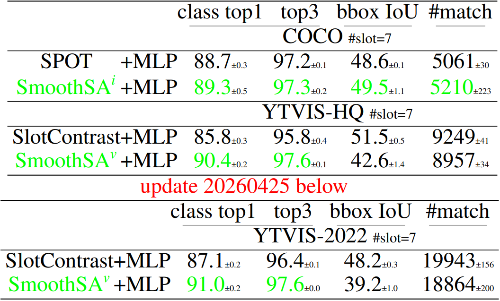

# `SmoothSA` Smoothing Slot Attention Iterations and Recurrences


[](https://arxiv.org/abs/2508.05417)
<!-- [](https://www.python.org) -->[](LICENSE)
[](https://github.com/Genera1Z/SmoothSA?tab=readme-ov-file#-model-checkpoints--training-logs)
[](https://github.com/Genera1Z/SmoothSA?tab=readme-ov-file#-model-checkpoints--training-logs)


Slot Attention (SA) and its variants lie at the heart of mainstream Object-Centric Learning (OCL). Objects in an image can be aggregated into respective slot vectors, by \textit{iteratively} refining cold-start query vectors, typically three times, via SA on image features. For video, such aggregation is \textit{recurrently} shared across frames, with queries cold-started on the first frame while transitioned from the previous frame's slots on non-first frames. However, the cold-start queries lack sample-specific cues thus hinder precise aggregation on the image or video's first frame; Also, non-first frames' queries are already sample-specific thus require transforms different from the first frame's aggregation. We address these issues for the first time with our \textit{SmoothSA}: (1) To smooth SA iterations on the image or video's first frame, we \textit{preheat} the cold-start queries with rich information of input features, via a tiny module self-distilled inside OCL; (2) To smooth SA recurrences across all video frames, we \textit{differentiate} the homogeneous transforms on the first and non-first frames, by using full and single iterations respectively. Comprehensive experiments on object discovery, recognition and downstream benchmarks validate our method's effectiveness. Further analyses intuitively illuminate how our method smooths SA iterations and recurrences.


<!-- ## 🎉 Accepted to ICLR 2026 as a Poster -->

Official source code, model checkpoints and training logs for paper "**Smoothing Slot Attention Iterations and Recurrences**".

**Our model achitecture**:


## 🏆 Performance

**Object discovery accuracy**: (Input resolution is **256×256** (224×224); **DINO2 ViT-S/14** is used for encoding)
Numbers are detailed in [acc-v3.xlsx](acc-v3.xlsx).


**Object discovery visualization**:


**Object recognition accuracy**:
Numbers are detailed in [acc-recogn-v3.xlsx](acc-recogn-v3.xlsx).




## 🌟 Highlights

⭐⭐⭐ ***Please check GitHub repo [VQ-VFM-OCL](https://github.com/Genera1Z/VQ-VFM-OCL).*** ⭐⭐⭐


## 🧭 Repo Stucture

[Source code](https://github.com/Genera1Z/SmoothSA).
```shell
- config-smoothsa/      # *** configs for our SmoothSA ***
- config-spot/          # configs for baseline SPOT
- object_centric_bench/
  - datum/              # dataset loading and preprocessing
  - model/              # model building
    - ...
    - smoothsa.py       # *** for our SmoothSA model building ***
    - randsfq.py        # *** for our SmoothSA model building ***
    - ...
  - learn/              # metrics, optimizers and callbacks
- train.py
- eval.py
- requirements.txt
```

[Releases](https://github.com/Genera1Z/SmoothSA/releases).
```shell
- archive-smoothsa/     # *** our RandSF.Q models and logs ***
- archive-spot/         # baseline model checkpoints and training logs
- archive-recogn/       # object recognition models based on SmoothSA and SPOT
```


## 🚀 Converted Datasets

Datasets ClevrTex, COCO, VOC, MOVi-C, MOVi-D and YTVIS, which are converted into LMDB format and can be used off-the-shelf, are available as below.
- [dataset-clevrtex](https://github.com/Genera1Z/VQ-VFM-OCL/releases/tag/dataset-clevrtex): converted dataset [ClevrTex](https://www.robots.ox.ac.uk/~vgg/data/clevrtex).
- [dataset-coco](https://github.com/Genera1Z/VQ-VFM-OCL/releases/tag/dataset-coco): converted dataset [COCO](https://cocodataset.org).
- [dataset-voc](https://github.com/Genera1Z/VQ-VFM-OCL/releases/tag/dataset-voc): converted dataset [VOC](http://host.robots.ox.ac.uk/pascal/VOC).
- [dataset-movi_c](https://github.com/Genera1Z/RandSF.Q/releases/tag/dataset-movi_c): converted dataset [MOVi-C](https://github.com/google-research/kubric/blob/main/challenges/movi).
- [dataset-movi_d](https://github.com/Genera1Z/VQ-VFM-OCL/releases/tag/dataset-movi_d): converted dataset [MOVi-D](https://github.com/google-research/kubric/blob/main/challenges/movi).
- [dataset-ytvis](https://github.com/Genera1Z/RandSF.Q/releases/tag/dataset-ytvis): converted dataset [YTVIS](https://youtube-vos.org/dataset/vis), the [high-quality](https://github.com/SysCV/vmt?tab=readme-ov-file#hq-ytvis-high-quality-video-instance-segmentation-dataset) version.


## 🧠 Model Checkpoints & Training Logs

**The checkpoints and training logs (@ random seeds 42, 43 and 44) for all models** are available as [releases](https://github.com/Genera1Z/SmoothSA/releases). All backbones are unified as DINO2-S/14.
- [archive-smoothsa](https://github.com/Genera1Z/SmoothSA/releases/tag/archive-smoothsa): Our SmoothSA trained on datasets ClevrTex, COCO, VOC, MOVi-C/D and YTVIS.
    - Model checkpoints and training logs of our own method.
- [archive-spot](https://github.com/Genera1Z/SmoothSA/releases/tag/archive-spot): SPOT on ClevrTex, COCO and VOC.
    - My implementation of paper **SPOT: Self-Training with Patch-Order Permutation for Object-Centric Learning with Autoregressive Transformers**, CVPR 2024.
- For other image OCL baselines, **SLATE**, **DINOSAUR**, **SlotDiffusion** and **DIAS**, please check repo [VQ-VFM-OCL](https://github.com/Genera1Z/VQ-VFM-OCL?tab=readme-ov-file#-model-checkpoints--training-logs) and [DIAS](https://github.com/Genera1Z/DIAS?tab=readme-ov-file#-model-checkpoints--training-logs);
- For other video OCL baselines, **VideoSAUR**, **SlotContrast** and **RandSF.Q**, please check repo [RandSF.Q](https://github.com/Genera1Z/RandSF.Q?tab=readme-ov-file#-model-checkpoints--training-logs).
- [archive-recogn](https://github.com/Genera1Z/SmoothSA/releases/tag/archive-recogn): Object recognition models based on our SmoothSA and baseline SPOT, trained on datasets COCO and YTVIS.
    - Slots extracted by SmoothSA or SPOT are matched with ground-truth object segmentations by some threshold, and the matched slots are used to train category classification and bounding box regression.
- For other object recognition baselines, **RandSF.Q** and **SlotContrast**, please check repo [RandSF.Q](https://github.com/Genera1Z/RandSF.Q?tab=readme-ov-file#-model-checkpoints--training-logs).


## 🔥 How to Use

Take SmoothSA on COCO as an example.

**(1) Environment**

To set up the environment, run:
```shell
# python 3.11
pip install -r requirements.txt
```

**(2) Dataset**

To prepare the dataset, download ***Converted Datasets*** and unzip to `path/to/your/dataset/`. Or convert them by yourself according to ```XxxDataset.convert_dataset()``` docs.

**(3) Train**

To train the model, run:
```shell
python train.py \
    --seed 42 \
    --cfg_file config-smoothsa/smoothsa_r-coco.py \
    --data_dir path/to/your/dataset \
    --save_dir save
```

**(4) Evaluate**

To evaluate the model, run:
```shell
python eval.py \
    --cfg_file config-smoothsa/smoothsa_r-coco.py \
    --data_dir path/to/your/dataset \
    --ckpt_file archive-smoothsa/smoothsa_r-coco/best.pth \
    --is_viz True \
    --is_img True
# object discovery accuracy values will be printed in the terminal
# object discovery visualization will be saved to ./smoothsa_r-coco/
```


## 🤗 Contact & Support

If you have any issues on this repo or cool ideas on OCL, please do not hesitate to contact me!
- page: https://genera1z.github.io
- email: rongzhen.zhao@aalto.fi, zhaorongzhenagi@gmail.com

If you are applying OCL (not limited to this repo) to tasks like **visual question answering**, **visual prediction/reasoning**, **world modeling** and **reinforcement learning**, let us collaborate!


## ⚗️ Further Research

My further research works on OCL can be found in [my repos](https://github.com/Genera1Z?tab=repositories) or [my academic page](https://genera1z.github.io).


## 📚 Citation

If you find this repo useful, please cite our work.
```
@article{zhao2025smoothsa,
  title={{Smoothing Slot Attention Iterations and Recurrences}},
  author={Zhao, Rongzhen and Yang, Wenyan and Kannala, Juho and Pajarinen, Joni},
  journal={arXiv:2508.05417},
  year={2025}
}
```
